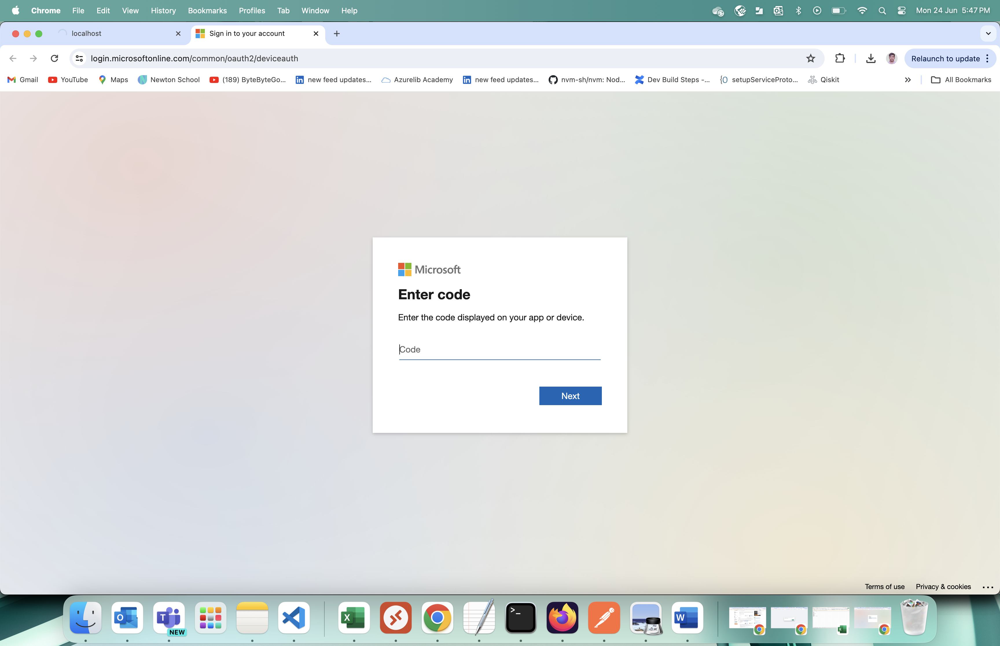
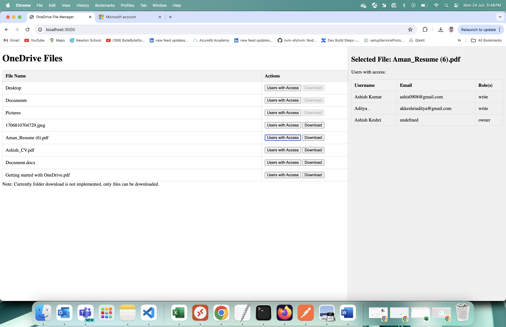

# What does this app do:
- List files that are there in Users OneDrive root directory
- User can download files (no support for downloading folders)
- List all users who have access to the file when clicked on "Users with Access" button. It also is real time where if users are added or removed access to the file, it updates the list in real time. For this I haven't used subscription which I believe would be the correct way to do but have done hack kind of thing and is basically checking the list update after 3 sec interval from the client side.

# How to run the completed project

## Prerequisites

To run the completed project in this folder, you need the following:

- [Node.js](https://nodejs.org) installed on your development machine. (**Note:** This tutorial was written with Node.js version 16.14.2. The steps in this guide may work with other versions, but that has not been tested.)
- Either a personal Microsoft account with a mailbox on Outlook.com, or a Microsoft work or school account. If you don't have a Microsoft account, there are a couple of options to get a free account:
  - You can [sign up for a new personal Microsoft account](https://signup.live.com/signup?wa=wsignin1.0&rpsnv=12&ct=1454618383&rver=6.4.6456.0&wp=MBI_SSL_SHARED&wreply=https://mail.live.com/default.aspx&id=64855&cbcxt=mai&bk=1454618383&uiflavor=web&uaid=b213a65b4fdc484382b6622b3ecaa547&mkt=E-US&lc=1033&lic=1).
  - You can [sign up for the Microsoft 365 Developer Program](https://developer.microsoft.com/microsoft-365/dev-program) to get a free Microsoft 365 subscription.

## How to run

In your command-line interface (CLI), navigate to the project directory and run the following command.

```Shell
npm install
node index.js
```

- Once the server is started listening on port 3000, open the [http://localhost:3000](http://localhost:3000) it will start processing, come back to CLI, it will show message with a link and code on CLI (you may see multiple logs, use the last one).
- When you open this link it it will ask for the code paste code and proceed.
- After this it will ask to login into Microsoft Account, once logged in, it will ask for certain permissions, grant the permission.
Comeback to [local host](http://localhost:3000) it will list the OneDrive Files.


## Output






